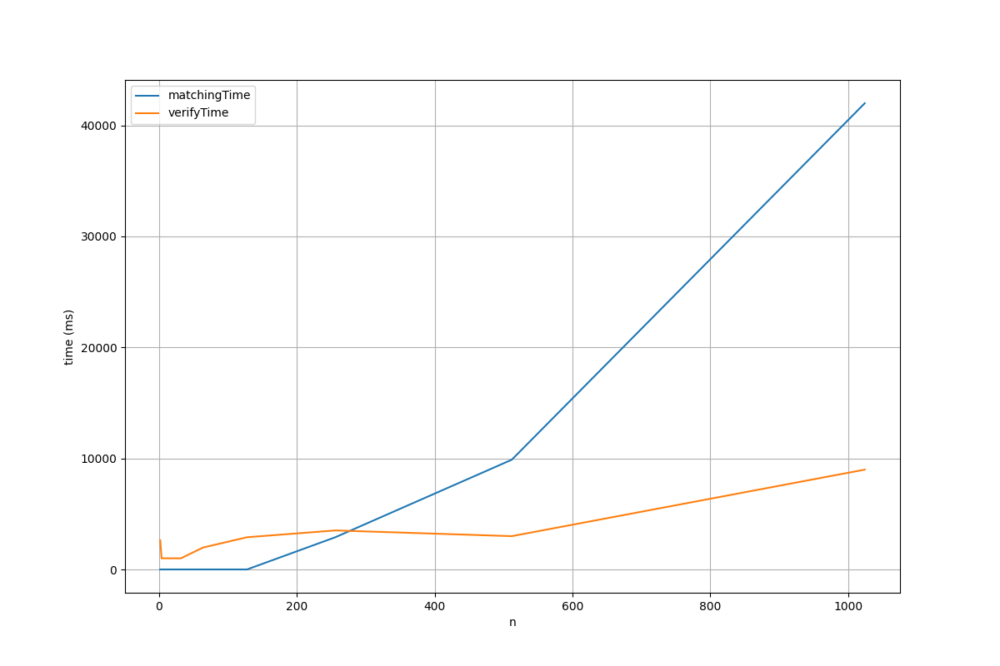

# COP4533-Programming-Assignment-1
# Group: Cesar Gonzales (UFID: 16089812) and Maria Juliana Tady (UFID: 99152158)
C++ was used for better scalibility and the C++ STL data structures

# The files are :
matcher.cpp (Task A), verifier.cpp (Task B), example.in and example.out (expected input and output files), plot.py (graph generation), and main.cpp (scalability test)

# Part A:
To run matcher, the example.in is provided
1. cd src
2. g++ matcher.cpp -o main
3. .\main, this will print out the matching results which you can compare with the expected example.out

# Part C :
For Part C, to address the issues with graphing in C++, we created a main.cpp file that will take user input of n to be used as 2^n. It will then randomly generate preference lists for both hospitals and students. From there a matchingTime and verificationTime function will run and write the results into a .csv file using the formant n,matchingTime,verificationTime. The plot.py will then be run to generate the graph.

# Observations: 
The matching algorithm scales well alongside the increase of n; however as n increases, the verification runtime is much slower as shown by the graph. The runtime is recorded in microseconds for closer analysis.

# How To Compile
1. cd src
2. g++ main.cpp -o main
3. .\main, this will prompt you to enter a value n and a string for a filename
4. ensure that plot.py is in the output folder, as well as having the correct name in pan.read_csv(" ".csv)
Note: Two figures will appear, however, only look at figure 2.

